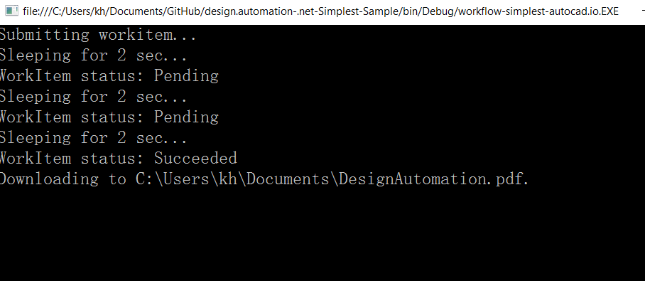

# Design Automation API Basic Sample
(Formely AutoCAD I/O)

## Description

This is the simplest C# client that uses the predefined PlotToPDF activity. It is the sample for the tutorial of design automation API.

## Dependencies

Visual Studio 2012, 2013, 2015.

##Setup/Usage Instructions

* Restore the packages of the project by [NuGet](https://www.nuget.org/). The simplest way is
  * VS2012: Projects tab >> Enable NuGet Package Restore. Then right click the project>>"Manage NuGet Packages for Solution" >> "Restore" (top right of dialog)
  * VS2013/VS2015:  right click the project>>"Manage NuGet Packages for Solution" >> "Restore" (top right of dialog)
* Apply credencials of Design Automation API from https://developer.autodesk.com/. Put your consumer key and secret key in [program.cs](./Program.cs) 
*  Run project, you will see a status in the console:
* if everything works well, the result file (pdf) and the report files will be downloaded at **MyDocuments**.
* if there is any error with the process, check the report file what error is indicated.
* 
Please refer to [Design Automation API v2 API documentation](https://developer.autodesk.com/en/docs/design-automation/v2/overview/).

## Questions

Please post your question at our [Forge Support Portal](https://developer.autodesk.com/en/support/get-help).

## License

These samples are licensed under the terms of the [MIT License](http://opensource.org/licenses/MIT). Please see the [LICENSE](LICENSE) file for full details.

## Written by 

Jonathan Miao & Albert Szilvasy
